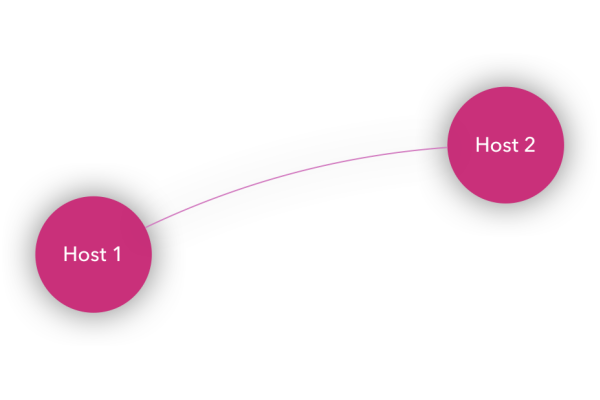
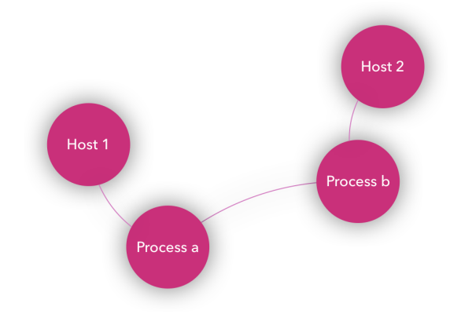

# neo4j-clj: a new Neo4j library for Clojure

_**On designing a 'simple' interface to the Neo4j graph database.**_

---

While creating a platform where humans and AI collaborate to detect and mitigate cybersecurity threats at [CYPP](https://www.cypp.de), we chose to use [Clojure](https://clojure.org/) and [Neo4j](https://neo4j.com/) as part of our tech stack. To do so, we created a new driver library (around the Java Neo4j driver), following the Clojuresque way of making simple things easy. And we chose to share it, to co-develop it under the Gorillalabs organization. Follow along to understand our motivation, get to know our design decisions, and see examples. If you choose a similar tech stack, this should give you a head start.

## Who we are

[Gorillalabs](https://github.com/gorillalabs/) is a developer-centric organization (not a Company) dedicated to Open Source Software development, mainly in Clojure.

I ([@Chris_Betz on twitter](https://twitter.com/Chris_Betz), [@chrisbetz on Github](https://github.com/chrisbetz)) created gorillalabs to host [Sparkling](https://github.com/gorillalabs/sparkling), a Clojure library for Apache Spark. Coworkers joined in, and now Gorillalabs brings together people and code from different employers to create a neutral collaboration platform. I work at CYPP, simplifying cyber security for mid-sized companies.

Most of Gorillalabs projects stem from the urge to use the best tools available for a job and make them work in our environment. That's the fundamental idea and the start of our organization. And for our project at CYPP, using Clojure and Neo4j was the best fit.

## Why Clojure?

I started using Common LISP in the 90ies, moved to Java development for a living, and switched to using Clojure in production in 2011 as a good synthesis of the two worlds. And, while constantly switching roles from designing and developing software to managing software development back and forth, I specialized in delivering research-heavy projects.

For many of those projects, Clojure has two nice properties: First, it comes with a set of immutable data structures (reducing errors a lot, making it easier to evolve the domain model). And second, with the combination of ClojureScript and Clojure, you can truly use one language in backend and frontend code. Although you need to understand different concepts on both ends, with your tooling staying the same, it is easier to develop vertical (or feature) slices instead of horizontal layers. Check out my EuroClojure 2017 talk on that, if you're interested.

[](https://www.youtube.com/watch?v=G1JWYxvucZ4)


## Graphs are everywhere - so make use of them

For threat hunting, i.e. the process of detecting cybersecurity threats in an organisation, graphs are a natural data modelling tool. The most obvious graph is the one where computers are connected through TCP/IP connections. You can find malicious behaviour if one of your computers shows unwanted connections. (Examples are over-simplified here.)



But that's just the 30.000-feet view. In fact, connections are between processes running on computers. And you see malicious behaviour if a process binds to an unusual port.



Processes are running with a certain set of privileges defined by the "user" running the process. Again, it's suspicious if a user who should be unprivileged started a process listening for an inbound connection.


You get the point: Graphs are everywhere, and they help us cope with threats in a networked world.

Throughout our quest for the best solution around, we experimented with other databases and query languages, but we came to Neo4j and Cypher. First, it's a production quality database solution, and second, it has a query language you really can use. We used [TinkerPop/Gremlin](http://tinkerpop.apache.org/gremlin.html) before, but found it not easy to use for simple things, and really hard for complex queries.

## Why we created a new driver

There's already a [Neo4j driver for Clojure](https://clojars.org/clojurewerkz/neocons). There's even an [example project on the Neo4j website](https://neo4j.com/developer/clojure/). What on earth were we thinking creating our own Neo4j driver?

Neo4j introduced [Bolt](https://boltprotocol.org/) on Neo4j 3.x as _the_ new protocol to interact with Neo4j. It made immediate sense, however, neocons did not pick it up, at least not at the pace we needed. Instead, it seemed as if the project lost traction, having had only very few contributions for a long time. So we needed to decide whether we should fork neocons to move it to Neo4j 3.x or not.

However, with bolt and the new [Neo4j Java Driver](https://github.com/neo4j/neo4j-java-driver), we would have implemented a second, parallel implementation of the driver. That was the point where we decided to go all the way building a new driver: neo4j-clj was born.

## Design choices and code examples

Creating a new driver gave us the opportunity to fit it exactly to our needs and desires. We made choices you might like or disagree with, but you should know why we made them.

If you want to follow the examples below, you need to have a Neo4j instance up and running.

Then, you just need to know one namespace alias for `neo4j-clj.core` and one connection to your test database (also named `db`):

```clojure
(require '[neo4j-clj.core :as db])

(def db (db/connect "bolt://localhost:7687"
                    "neo4j"
                    "password-you-gave-during-neo4j-setup"))
```


### Using "raw" Cypher

The most obvious thing is our choice to keep "raw" Cypher queries as strings, but to be able to use them as Clojure functions. The idea to this is actually not new and not our own, but borrowed from [yesql](https://github.com/krisajenkins/yesql). Doing so, you do not bend one language (Cypher) into another (Clojure), but keep each language for the problems its designed for. And, as a bonus, you can easily copy code over from one tool (code editor) to another (Neo4j browser), or use plugins to your IDE to query a database with the Cypher queries from your code.

So, to create a function wrapping a Cypher query, you just wrap that Cypher string in a `defquery` macro like this:

```clojure
(db/defquery hosts
  "MATCH (h:Host) RETURN h as host")
```

And, you can easily copy the string into your Neo4j browser or any other tool to check the query, profile it, whatever you feel necessary.

With this, you can easily run the query like this:

```clojure
(with-open [session (db/get-session db)]
  (hosts session))
```
and, depending on the data in your test database, will end up with a sequence of maps representing your hosts. For me, it's something like this:

```clojure
({:host {:hostId "InnenstadtTätigKoennen",
         :nodeKey "gY8sLvVSU5vHVlvSMaTMgglM9DC6BLUwPIU4OoWiuT7S/g==",
         :lastSeen 1513098644784,
         :id "eee05cc72ab44522a83927f961bf459c",
         :created 1513098644784}}
 {:host {:hostId "DataWurdenEine",
         :nodeKey "rYSqgx2lxPfuObVwCX4ONBZMM1uubPv2BXCmZCL5IEIUFoNs6z7YOrSs",
         :lastSeen 1513098135839,
         :id "0af113d8e2a94636a05c0594f4359c0d",
         :created 1513098135839}}
...
)
```

This style makes it more clear that you should not be constructing queries on the fly, but use a defined set of queries in your codebase. If you need a new query, define one specifically for that purpose. Think about which indices you need, how this query performes best, reads best, you name it.

However, this decision has some drawbacks. There's no compiler support, no IDE check, as Cypher queries are not recognized as such. They are just strings. However, there's not much Cypher support in IDEs anyhow. That's different than with yesql, where you usually have SQL linting with appropriate files.

Each query function will return a list. Even if it's empty. There's no convenience function for creating queries to get a single object (for something like `host-by-id`). If you know there's only one, pick it using `first`.


### Relying on the Java driver, but working with Clojure data structures

We just make use of the Java driver, so basically, neo4j-clj is only a thin wrapper. However, we wanted to be able to live in the Clojure world
as much as possible. To us, that meant we need to interact with Neo4j using Clojure datastructures. You saw that in the first example, where a query function returns a list of maps.

However, you can also parameterize your queries using maps:

```clojure
(db/defquery host-by-id
             "MATCH (h:Host {hostId: $host.id}) RETURN h as host")
=> #'user/host-by-id


(with-open [session (db/get-session db)]
  (host-by-id session {:host {:id "InnenstadtTätigKoennen"}}))
=>
({:host {:hostId "InnenstadtTätigKoennen",
         :nodeKey "gY8sLvVSU5vHVlvSMaTMgglM9DC6BLUwPIU4OoWiuT7S/g==",
         :lastSeen 1513098644784,
         :id "eee05cc72ab44522a83927f961bf459c",
         :created 1513098644784}})
```

This example is more complex than neccessary just to make a point clear: You can destructure Clojure maps `{:host {:id "..."}}` by navigating them in Cypher `$host.id`.

Nice thing is, you can easily test these queries in the Neo4j browser if you set the parameters correct:

```cypher
:param host: {"id": "InnenstadtTätigKoennen"}
```

### Joplin integration built-in

We're fans of having seeding and migration code for the database in our version control. Thus, we use [Joplin](https://github.com/juxt/joplin) and we suggest, you do, too. That's why we built Joplin support right into neo4j-clj.

With Joplin, you can write migrations and seed functions to populate your database. This isn't as important in Neo4j as it is in relational databases, but it's necessary, e.g. for index or constraint generation.

First, Joplin migrates your database, if it isn't at latest stage (`path-to-joplin-neo4j-migrators` points to a folder of migration files, which are applied in alphabetical order):

```clojure
(require '[joplin.core :as joplin]) ;; require Joplin itself and
(require '[joplin.neo4j.database])  ;; neo4j-clj Joplin adapter


(joplin/migrate-db {:db {:type :neo4j,
                         :url  "bolt://my.neo4j.host:7687"
                         :username "neo4j"
                         :password "password-you-gave-during-neo4j-setup"}
                    :migrator "path-to-joplin-neo4j-migrators"})
``` 

And each migration file has (at least) the two functions `up` and `down` to perform the actual migration. For example:

```clojure
(ns myproject.neo4j.migrations.20171024T112338Z-unique-org-unit-id
  (:require [joplin.neo4j.database :refer [with-connection]]
            [neo4j-clj.core :refer [defquery]]))

(defquery create-org-unit-id-exists-constraint
  "CREATE CONSTRAINT ON (u:OrgUnit) ASSERT exists(u.id)")

(defquery drop-org-unit-id-exists-constraint
  "DROP CONSTRAINT ON (u:OrgUnit) ASSERT exists(u.id)")

(defquery create-unique-org-unit-id-constraint
  "CREATE CONSTRAINT ON (u:OrgUnit) ASSERT u.id IS UNIQUE")

(defquery drop-unique-org-unit-id-constraint
  "DROP CONSTRAINT ON (u:OrgUnit)  u.id IS UNIQUE")

(defn up [db]
  (with-connection db session
    (create-org-unit-id-exists-constraint session)
    (create-unique-org-unit-id-constraint session)))

(defn down [db]
  (with-connection db session
    (drop-org-unit-id-exists-constraint session)
    (drop-unique-org-unit-id-constraint session)))
```


Also, you can seed your database from a function like this:

```clojure
(ns myproject.neo4j.seed
  (:require [neo4j-clj.core :refer [connect get-session defquery]]))

(defquery db>create-dev-user!
  "MERGE (user:User {id: $devUserId})
   RETURN user")

(defn seed-neo! [target & args]
  (let [config (:db target)
        db     (connect (:url config)
                        (:username config)
                        (:password config))]
    (with-open [session (get-session db)]
      (db>create-dev-user! session {:devUserId "__dev-user__"}))))
```

Now you can seed your database like this. Here, we use a config identical to the one from migration:

```clojure
(myproject.neo4j.seed/seed-neo! {:db {:type :neo4j,
                                      :url  "bolt://my.neo4j.host:7687"
                                      :username "neo4j"
                                      :password "password-you-gave-during-neo4j-setup"})
```

With this seed function you see a style we got used to: We prefix all the functions created by `defquery` with `db>` and we use the `!` suffix to mark functions with side-effects. That way, you see when code leaves your platform and what you can expect to happen.

### Tested all the way

Being big fans of testing, we wanted the tests for our driver to be as easy and as fast as possible. You should be able to combine that with a REPL-first approach, where you can experiment on the REPL. Luckily, you can run Neo4j in embedded mode, so we did not need to rely on an existing Neo4j installation or a running docker image of Neo4j. Instead, all our tests run isolated in embedded Neo4j instances. We just needed to make sure not to use the Neo4j embedded API, but the bolt protocol. Easy, my colleague [Max Lorenz](https://github.com/maxlorenz) just bound the embedded Neo4j instance to an open port and connected the driver to that, just as you would do in production.

Using a `with-temp-db`-fixture, we just create a new session against that embedded database and test the neo4j-clj functions in a round-trip without external requirements. Voilá.

## Use it, fork it, blog it

neo4j-clj is ready to be used. We do. We'd love to hear from you ([@gorillalabs_de](https://twitter.com/gorillalabs_de) or [@chris_betz](https://twitter.com/Chris_Betz)). Share your experiences with neo4j-clj.


There are still some rough edges: Maybe you need more configuration options. Or support for some other property types, especially the new Date/Time and Geolocation types. We'll add stuff over time. If you need something specific, please open an [issue on Github](https://github.com/gorillalabs/neo4j-clj/issues), or add it yourself and create a [Pull Request](https://github.com/gorillalabs/neo4j-clj/pulls) on the 'develop' branch.

We welcome contributions, so feel free to hack right away!